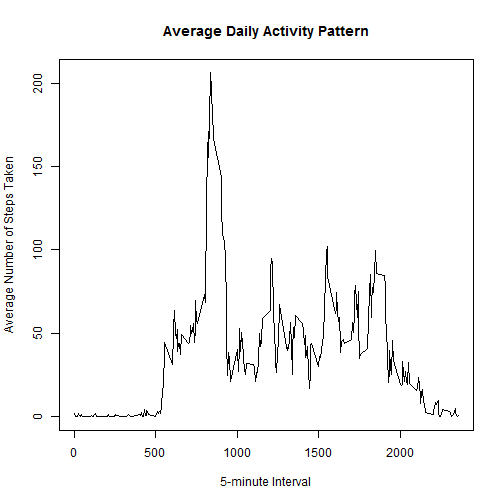
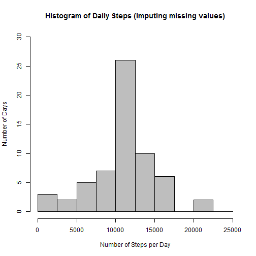

### Data
 
The data for this assignment can be downloaded from the course web site:

- Dataset: [Activity monitoring data](https://d396qusza40orc.cloudfront.net/repdata%2Fdata%2Factivity.zip) [52K]

The variables included in this dataset are:

- *steps*: Number of steps taking in a 5-minute interval (missing values are coded as NA)

- *date*: The date on which the measurement was taken in YYYY-MM-DD format

- *interval*: Identifier for the 5-minute interval in which measurement was taken

The dataset is stored in a comma-separated-value (CSV) file and there are a total of 17,568 observations in this datase

### Process

#### Loading and preprocessing the data

* load data
* convert the string of dates to the date format
* summary data


```r
# load data
data <- read.csv("./data/activity.csv", stringsAsFactors=FALSE)

# convert the string of dates to the date format
library(lubridate)
data$date <- ymd(data$date)

# summary data
summary(data)
```

```
##      steps             date               interval     
##  Min.   :  0.00   Min.   :2012-10-01   Min.   :   0.0  
##  1st Qu.:  0.00   1st Qu.:2012-10-16   1st Qu.: 588.8  
##  Median :  0.00   Median :2012-10-31   Median :1177.5  
##  Mean   : 37.38   Mean   :2012-10-31   Mean   :1177.5  
##  3rd Qu.: 12.00   3rd Qu.:2012-11-15   3rd Qu.:1766.2  
##  Max.   :806.00   Max.   :2012-11-30   Max.   :2355.0  
##  NA's   :2304
```

#### What is mean total number of steps taken per day?

* calculate the total number of steps taken per day
* plot histogram of the total number of steps taken each day


```r
# calculate the total number of steps taken per day
totalsteps <- tapply(data$steps, data$date, sum, na.rm=TRUE)

# plot histogram of the total number of steps taken each day
hist(totalsteps, col='grey', breaks=c(0, 2500,5000,7500, 10000,12500,15000,17500,20000,22500, 25000), ylim = c(0,20), main = paste("Histogram of Daily Steps"), xlab="Number of Steps per Day", ylab="Number of Days")
```

 

* calculate and report the mean and median of the total number of steps taken per day


```r
steps.mean = mean(totalsteps)
steps.median = median(totalsteps)

print(paste("The mean of the total number of steps taken per day is: ", round(steps.mean, digits=2)))
```

```
## [1] "The mean of the total number of steps taken per day is:  9354.23"
```

```r
print(paste("The median of the total number of steps taken per day is: ", steps.median))
```

```
## [1] "The median of the total number of steps taken per day is:  10395"
```

#### What is the average daily activity pattern?

* calcuate the average number of steps by time interval
* plot the 5-minute interval (x-axis) and the average number of steps taken


```r
# calcuate the average number of steps by time interval
avgstepsinterval <- tapply(data$steps, data$interval, mean, na.rm=TRUE)

# plot the 5-minute interval (x-axis) and the average number of steps taken
plot(names(avgstepsinterval), avgstepsinterval, type="l", xlab="5-minute Interval", ylab="Average Number of Steps Taken", main="Average Daily Activity Pattern")
```

 

* identify the 5-minute interval, on average across all the days in the dataset, contains the maximum number of steps


```r
maxinterval <- names(which(avgstepsinterval == max(avgstepsinterval)))

print(paste("The 5-minute interval that contains the maximum number of steps on average is at the ", maxinterval, " minute of a day"))
```

```
## [1] "The 5-minute interval that contains the maximum number of steps on average is at the  835  minute of a day"
```


#### Imputing missing values

* calculate and report the total number of missing values in the dataset (i.e. the total number of rows with NAs)


```r
print(paste("There are ", sum(is.na(data$steps)), " missing values in the dataset"))
```

```
## [1] "There are  2304  missing values in the dataset"
```

* strategy for filling in missing values in the dataset

I plan to replace the missing values with the mean value of the respective 5-minute interval.

* create a new dataset that is equal to the original dataset but with the missing data filled in


```r
# make a new copy of the current dataset
data2 <- data

# replace NAs in the new dataset with the mean value of the respective 5-minute interval
x <- which(is.na(data$steps))
for( i in x)
{
  y <- data[i, "interval"]
  z <- round(avgstepsinterval[as.character(y)], digits = 0)
  data2[i, "steps"] <- z
  
}

summary(data2)
```

```
##      steps             date               interval     
##  Min.   :  0.00   Min.   :2012-10-01   Min.   :   0.0  
##  1st Qu.:  0.00   1st Qu.:2012-10-16   1st Qu.: 588.8  
##  Median :  0.00   Median :2012-10-31   Median :1177.5  
##  Mean   : 37.38   Mean   :2012-10-31   Mean   :1177.5  
##  3rd Qu.: 27.00   3rd Qu.:2012-11-15   3rd Qu.:1766.2  
##  Max.   :806.00   Max.   :2012-11-30   Max.   :2355.0
```

* plot histogram of the total number of steps taken each day based on the new dataset


```r
# calculate the total number of steps taken per day based on the new dataset
totalsteps2 <- tapply(data2$steps, data2$date, sum)

# plot histogram of the total number of steps taken each day based on the new dataset
hist(totalsteps2, col='grey', breaks=c(0, 2500,5000,7500, 10000,12500,15000,17500,20000,22500, 25000), ylim = c(0,30), main = paste("Histogram of Daily Steps (Imputing missing values)"), xlab="Number of Steps per Day", ylab="Number of Days")
```

 


* calculate and report the mean and median of the total number of steps taken per day based on the new dataset


```r
steps.mean2 = mean(totalsteps2)
steps.median2 = median(totalsteps2)

print(paste("The mean of the total number of steps taken per day after imputing missing values is: ", round(steps.mean2, digits=2)))
```

```
## [1] "The mean of the total number of steps taken per day after imputing missing values is:  10765.64"
```

```r
print(paste("The median of the total number of steps taken per day after imputing missing values is: ", steps.median2))
```

```
## [1] "The median of the total number of steps taken per day after imputing missing values is:  10762"
```

* discussion: Do these values differ from the estimates from the first part of the assignment?

Yes. Before imputing the missing values, the mean value is 9354.23 and the median value is 10395. After imputing the missing values, the mean value is 10765.64 and the median value is 10762.

* discussion: What is the impact of imputing missing data on the estimates of the total daily number of steps?

After imputing the missing values, the histogram figure of daily steps is closer to the normal distribution accross a day. Therefore, it is believeable that imputing the missing values leads to the better description of the reality. 

#### Are there differences in activity patterns between weekdays and weekends?

* add a new column that distinguish weekdays from weekend in the data frame after imputing the missing values


```r
for (i in 1:nrow(data2))
{
  if(weekdays(data2$date[i]) == "Saturday" | weekdays(data2$date[i]) == "Sunday")
  {
    data2$dayOfWeek[i] = "weekend"
  }
  else
  {
    data2$dayOfWeek[i] = "weekday"
  }
}
```

* subset weekdays and weekend days


```r
data2.weekdays <- subset(data2, dayOfWeek == "weekday")
data2.weekends <- subset(data2, dayOfWeek == "weekend")
```

* plot plot the 5-minute interval (x-axis) and the average number of steps taken, comparing the weekdays data to the weekends data


```r
# calcuate the average number of steps by time interval, weekdays vs. weekends
avgstepsinterval.weekdays <- tapply(data2.weekdays$steps, data2.weekdays$interval, mean)
avgstepsinterval.weekends <- tapply(data2.weekends$steps, data2.weekends$interval, mean)

# prepare the data frame for plot
x <- names(avgstepsinterval.weekdays)
y1 <- avgstepsinterval.weekdays
y2 <- avgstepsinterval.weekends
df <- data.frame(x, y1, y2)

df$y1 = as.numeric(df$y1)
df$y2 = as.numeric(df$y2)
df$x <- as.character(df$x)
df$x <- as.numeric(df$x)

# use ggplot to plot both the weekdays and weekends in one figure
library(ggplot2)

g <- ggplot(df, aes(x))
g <- g + geom_line(aes(y=y1, colour="weekdays"))
g <- g + geom_line(aes(y=y2, colour="weekends"))
g <- g + ylab("Average Number of Steps Taken") + xlab("5-minute interval")
g <- g + scale_colour_manual("", 
                  breaks = c("weekdays", "weekends"),
                  values = c("red", "blue"))
g
```

 
